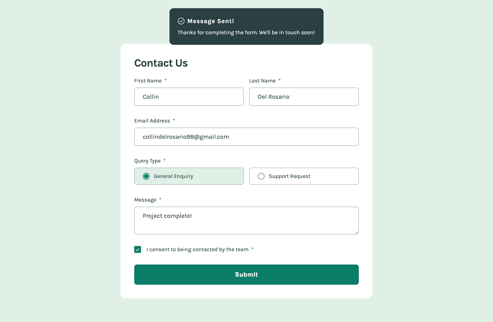
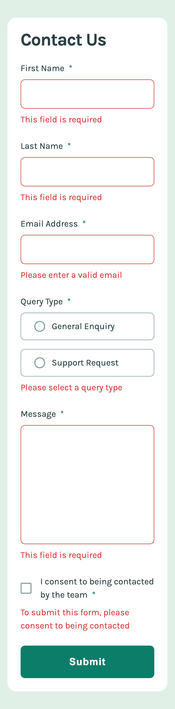

# Frontend Mentor - Contact form solution

This is a solution to the [Contact form challenge on Frontend Mentor](https://www.frontendmentor.io/challenges/contact-form--G-hYlqKJj). Frontend Mentor challenges help you improve your coding skills by building realistic projects.

## Table of contents

- [Overview](#overview)
  - [The challenge](#the-challenge)
  - [Screenshot](#screenshot)
  - [Links](#links)
- [My process](#my-process)
  - [Built with](#built-with)
  - [What I learned](#what-i-learned)
  - [Continued development](#continued-development)
  - [Useful resources](#useful-resources)
- [Author](#author)

## Overview

### The challenge

Users should be able to:

- Complete the form and see a success toast message upon successful submission
- Receive form validation messages if:
  - A required field has been missed
  - The email address is not formatted correctly
- Complete the form only using their keyboard
- Have inputs, error messages, and the success message announced on their screen reader
- View the optimal layout for the interface depending on their device's screen size
- See hover and focus states for all interactive elements on the page

### Screenshot




### Links

- Solution URL: [Github](https://github.com/delroscol98/signup-form)
- Live Site URL: [Github Pages](https://delroscol98.github.io/signup-form/)

## My process

### Built with

- Semantic HTML5 markup
- CSS custom properties
- Flexbox
- CSS Grid
- Mobile-first workflow
- Sass

### What I learned

The following code validates the form inputs concisely through a validation object. Each key is a form input, and each value is a validation function. The "for loop" loops through the validation object and stops looping as soon as a falsy [key, value] pair appears which leads to subsequent form input sections rendering their respective error messages. If there is no falsy [key, value] pairs, then the success message renders.

```js
const validateForm = () => {
  const validations = {
    first_name: validateStringInput(firstName),
    last_name: validateStringInput(lastName),
    email: validateEmail(),
    query: validateQuery(),
    message: validateStringInput(message),
    consent: validateConsent(),
  };

  for (const [, value] of Object.entries(validations)) {
    if (!value) {
      success.classList.add("u-hidden");
      return;
    } else {
      success.classList.remove("u-hidden");
    }
  }

  console.log(validations);
};
```

### Continued development

Moving forward, I would like to continue making accessible forms. Additionally, I would like to continue using valdation objects to validate form inputs using pure functions.

### Useful resources

- [Modern CSS](https://moderncss.dev/pure-css-custom-styled-radio-buttons/) - This helped me to style radio buttons

## Author

- Frontend Mentor - [@delroscol98](https://www.frontendmentor.io/profile/delroscol98)
